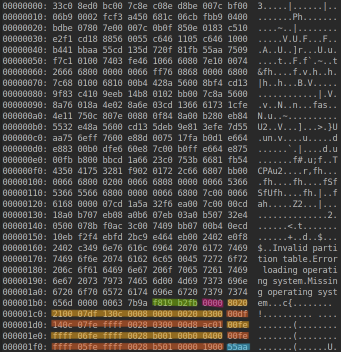
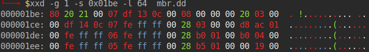
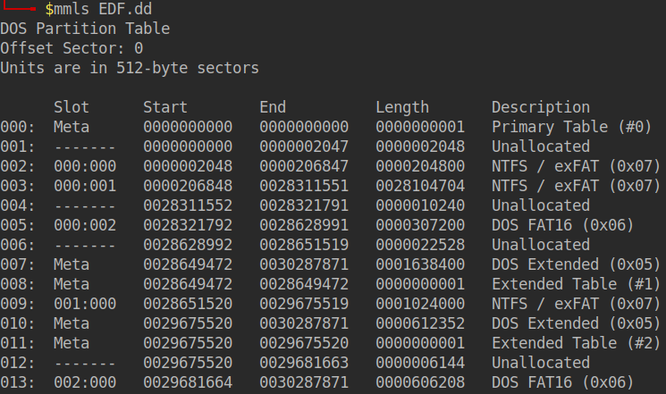
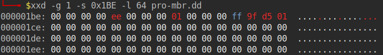
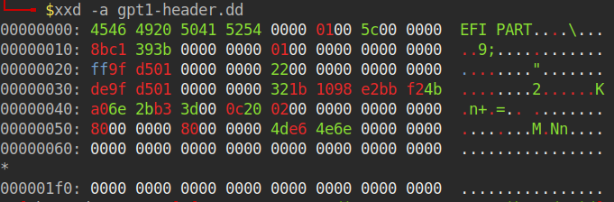
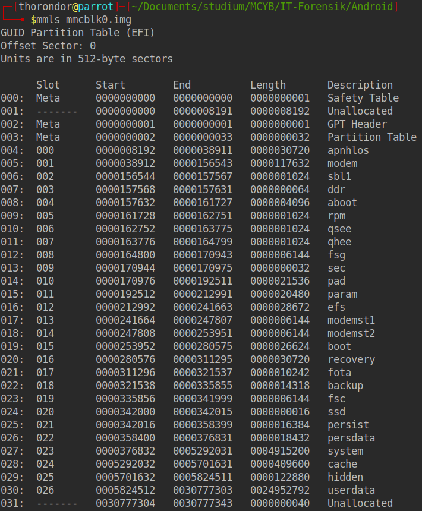

# Datenträgerforensik


## [Datenträgeraufbau](Datenträgeraufbau.md)

## Partitionierungsschemata

### MBR/DOS
- Partitionstabelle
  - Zunächst einal die Hexdump-Darstellung des Beginns eines Datenträgers mit DOS-Partitionierungsschemata:
    ```bash
    xxd EDF.dd | less
    ```
    Ausgabe:
    
    - `Nicht markiert`: Bootcode und Fehlermeldungen
    - `Grün`: Datenträgersignatur in Little Endian => `0xFBB219F8`
    - `Rosa`: reserviert TODO
    - `Gelb und Rot`: 4 Partitionseinträge
    - `Bs`: Windows Signatur `55aa`

    Anschließend mit dd den MBR herauskopieren:
    ```bash
    dd if=EDF.dd of=mbr.dd bs=512 count=1 conv=noerror,sync status=progress
    ```

- Partitionstabelle
  - Danach die primäre Partitionstabelle anzeigen lassen:
  ```bash
  xxd -g 1 -s 0x1BE -l 64 mbr.dd
  ```
  Ausgabe:
  
  
    - Bedeutung der einzelnen Felder eines MBR-Partitionseintrags:

  | Relativer Offset | Größe | Bedeutung | Besonderheit |
  |---:|---:|---|---|
  | `+0x00` | 1 Byte | Boot-Indikator | `0x80` = aktiv/bootfähig; `0x00` = nicht aktiv |
  | `+0x01` | 3 Byte | CHS-Startadresse | Historische Adressierung; heute meist nicht mehr maßgeblich |
  | `+0x04` | 1 Byte | Partitionstyp | Kennzeichnet den vorgesehenen Partitionstyp |
  | `+0x05` | 3 Byte | CHS-Endadresse | Historische Adressierung; häufig mit Platzhalterwerten belegt |
  | `+0x08` | 4 Byte | Start-LBA | Erster logischer Sektor; als Little-Endian-Wert gespeichert |
  | `+0x0C` | 4 Byte | Anzahl der Sektoren | Länge der Partition; als Little-Endian-Wert gespeichert |

    - Häufige MBR-Partitionstypen:

  | Wert | Bedeutung |
  |---:|---|
  | `0x00` | Leerer beziehungsweise unbenutzter Partitionseintrag |
  | `0x01` | FAT12 |
  | `0x02` | XENIX Root |
  | `0x03` | XENIX User |
  | `0x04` | FAT16 mit weniger als 32 MiB |
  | `0x05` | Erweiterte DOS-Partition mit CHS-Adressierung |
  | `0x06` | FAT16 mit mindestens 32 MiB |
  | `0x07` | HPFS, NTFS oder exFAT |
  | `0x0B` | FAT32 mit CHS-Adressierung |
  | `0x0C` | FAT32 mit LBA-Adressierung |
  | `0x0E` | FAT16 mit LBA-Adressierung |
  | `0x0F` | Erweiterte Partition mit LBA-Adressierung |
  | `0x82` | Linux Swap beziehungsweise Solaris |
  | `0x83` | Linux-Dateisystem |
  | `0x85` | Erweiterte Linux-Partition |
  | `0x8E` | Linux LVM |
  | `0xA5` | FreeBSD |
  | `0xA6` | OpenBSD |
  | `0xA8` | macOS beziehungsweise Darwin UFS |
  | `0xAB` | macOS Boot |
  | `0xAF` | Apple HFS/HFS+ |
  | `0xEE` | GPT Protective MBR |
  | `0xEF` | EFI-Systempartition |
  | `0xFD` | Linux RAID |

    - Start-LBA:
  Der Wert ist im Little Endian gespeichert, daher lautet der echte Wert `00 00 08 00` und wird zu `0x00000800 = 2048` übersetzt.
  
    - Anzahl der Sektoren:
    Die letzten vier Bytes enthalten die Länge der Partition in Sektoren. Auch dieser Wert ist in Little Endian gespeichert.
    - End-LBA berechnen:
    > End-LBA = Start-LBA + Anzahl der Sektoren − 1
- primäre und erweiterte Partitionen

Todo beschreibung und ausarbeitung
- Bootcode

Der Bootcode befindet sich am Anfang des MBR. Bei einem klassischen 
BIOS-Start sucht er in der Partitionstabelle nach einer als aktiv 
markierten Partition, lädt deren Volume Boot Record und übergibt diesem 
die weitere Ausführung.

Der Bootcode besitzt keine einheitlichen Flags, da es sich um ausführbare 
Maschinenbefehle handelt. Das Boot-Flag einer Partition steht stattdessen 
im ersten Byte ihres Partitionseintrags. Der Wert `0x80` kennzeichnet eine 
aktive Partition, während `0x00` eine inaktive Partition kennzeichnet.

- Ausgabe von mmls:
  
   
  | Slot | Bedeutung |
  |---:|---|
  | `Meta` | Zeigt DAS-Tables und Extended Partitions auf |
  | `-------` | zeigt Unallocated Backupsereiche an |
  | `000:000` | erste Primärepartition  |
  | `000:001` | zweite Primärepartition |
  | `001:000` | erste Partition der erweiterten Partition |
  | `002:000` | zweite Partition der erweiterten Partition |
  

### GPT

- **Protective MBR**  
  Der Protective MBR befindet sich in `LBA 0` und enthält üblicherweise einen Partitionseintrag vom Typ `0xEE`. Er verhindert, dass ältere Programme den GPT-Datenträger irrtümlich als unpartitioniert behandeln und überschreiben.
    

- **Primärer und sekundärer GPT-Header**  
  Der primäre GPT-Header liegt normalerweise in `LBA 1`, während sich seine Sicherung am Ende des Datenträgers befindet. Beide enthalten unter anderem die Datenträger-GUID sowie Position und Größe der Partitionstabelle.
  Mit dem folgenden Befehl kann der GPT Header kopiert und anschließend ausgelesen werden.
  ```bash
    dd if=EDF.dd of=gpt1-header.dd bs=512 count=1 skip=1 conv=noerror,sync
    ```
    
    Todo
- **Partitionseinträge und Prüfsummen**  
  Die Partitionseinträge enthalten unter anderem Typ-GUID, eindeutige Partitions-GUID, Start- und End-LBA, Attribute und Partitionsname. CRC32-Prüfsummen schützen den GPT-Header und die Partitionseinträge und ermöglichen die Erkennung von Beschädigungen.
    Todo

- **Microsoft Reserved Partition (MSR)**  
  Die MSR ist eine von Windows auf GPT-Datenträgern angelegte reservierte Partition ohne Dateisystem und Laufwerksbuchstaben. Sie stellt Speicherplatz für bestimmte interne Verwaltungs- und Partitionsoperationen bereit.
    Todo

- **EFI-Systempartition (ESP)**  
  Die ESP ist normalerweise mit FAT32 formatiert und enthält Bootloader, Treiber sowie weitere für den UEFI-Systemstart benötigte Dateien. Sie wird über eine festgelegte GPT-Typ-GUID als EFI-Systempartition gekennzeichnet.
    Todo

- Ausgabe von mmls
    
    Todo

## Verborgene beziehungsweise nicht zugewiesene Bereiche

- **HPA – Host Protected Area**  
  Ein durch ATA-Befehle geschützter Bereich am Ende eines Datenträgers, der vom Betriebssystem normalerweise nicht erkannt wird.

- **DCO – Device Configuration Overlay**  
  Eine Konfigurationsebene, mit der die gemeldete Kapazität und bestimmte Funktionen eines Datenträgers eingeschränkt werden können.

- **Nicht zugewiesener Speicher**  
  Speicherplatz, der aktuell keiner Partition zugeordnet ist und noch Fragmente früherer Daten enthalten kann.

- **Partition Gaps**  
  Nicht partitionierte Speicherbereiche zwischen Partitionen, in denen Datenreste oder absichtlich verborgene Daten liegen können.

- **SSD Over-Provisioning**  
  Für den SSD-Controller reservierter und für das Betriebssystem nicht direkt zugänglicher Flash-Speicher, der unter anderem für Wear Levelling und den Austausch defekter Speicherzellen verwendet wird.


## Verschlüsselung:
- BitLocker
- LUKS
- FileVault
- VeraCrypt
- Self-Encrypting Drives