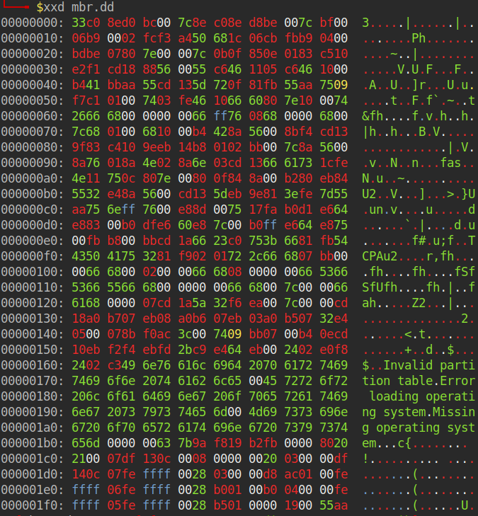

# Datenträgerforensik


## Datenträgeraufbau

### Sektoren und Blöcke

Ein **Sektor** ist eine kleinste adressierbare Speichereinheit eines Datenträgers. Klassische Festplatten verwenden häufig 512 Byte große Sektoren, während moderne Datenträger oft mit 4096 Byte großen physischen Sektoren arbeiten.

Ein **Block** ist eine logische Einheit, die ein Betriebssystem, Dateisystem oder Programm zur Verarbeitung von Daten verwendet. Seine Größe kann von der physischen Sektorgröße abweichen. Ein Block kann daher einen oder mehrere Sektoren umfassen.

Die Begriffe werden abhängig vom Kontext teilweise gleichbedeutend verwendet:

- **Sektor:** Einheit des Datenträgers
- **Block:** Einheit einer darüberliegenden logischen Ebene
- **Cluster:** Zuordnungseinheit eines Dateisystems aus einem oder mehreren Sektoren


Ein Dateisystemcluster besteht in diesem Fall aus acht Sektoren.

---

### Physische und logische Blockadressierung

Bei Datenträgern muss zwischen der physischen Speicherung und der logischen Darstellung gegenüber dem Betriebssystem unterschieden werden.

#### Physische Ebene

Die physische Ebene beschreibt, wie Daten tatsächlich auf dem Speichermedium gespeichert werden:

- magnetische Sektoren bei HDDs
- Flash-Pages und Erase Blocks bei SSDs
- physische Sektorgröße, beispielsweise 4096 Byte

Die genaue physische Position wird heute überwiegend vom Controller des Datenträgers verwaltet und ist für das Betriebssystem nicht direkt sichtbar.

#### Logische Ebene

Der Datenträger stellt dem Betriebssystem nummerierte logische Blöcke beziehungsweise Sektoren bereit. Das Betriebssystem greift auf diese Einheiten zu, ohne deren tatsächliche physische Lage kennen zu müssen.

```text
Betriebssystem → logischer Block → Controller → physischer Speicherort
```

Bei SSDs kann sich der physische Speicherort durch Wear Levelling und Garbage Collection verändern, obwohl die logische Adresse gleich bleibt.

Für die forensische Analyse ist deshalb meist die **logische Sicht** relevant, die ein Datenträgerabbild enthält.

---

### LBA

**LBA** steht für **Logical Block Addressing**. Dabei werden die logischen Sektoren eines Datenträgers fortlaufend nummeriert.

```text
LBA 0
LBA 1
LBA 2
LBA 3
...
```

Bei einem MBR-Datenträger befindet sich der MBR normalerweise bei `LBA 0`. Eine Partition kann beispielsweise bei `LBA 2048` beginnen.

Der Byte-Offset lässt sich aus der LBA-Adresse und der logischen Sektorgröße berechnen:

```text
Byte-Offset = LBA × logische Sektorgröße
```

Beispiel mit 512 Byte pro Sektor:

```text
Byte-Offset = 2048 × 512
Byte-Offset = 1.048.576 Byte
```

Die Partition beginnt damit bei einem Offset von `1 MiB`.

Der betreffende Sektor kann mit `dd` extrahiert werden:

```bash
dd if=festplattenabbild.dd of=sektor-2048.dd \
   bs=512 skip=2048 count=1
```

- `bs=512`: Größe eines logischen Sektors
- `skip=2048`: 2048 Sektoren überspringen
- `count=1`: einen Sektor kopieren

---

### Advanced Format (`4Kn`, `512e`)

**Advanced Format** bezeichnet Datenträger, deren physische Sektoren eine Größe von 4096 Byte besitzen. Größere Sektoren verbessern unter anderem die Speichereffizienz und Fehlerkorrektur.

#### 512n

Bei `512n` sind die logischen und physischen Sektoren jeweils 512 Byte groß:

```text
Logische Sektorgröße:  512 Byte
Physische Sektorgröße: 512 Byte
```

#### 512e

`512e` steht für **512-byte Emulation**. Der Datenträger verwendet physisch 4096-Byte-Sektoren, stellt dem Betriebssystem aber logische 512-Byte-Sektoren bereit:

```text
Logische Sektorgröße:   512 Byte
Physische Sektorgröße: 4096 Byte
```

Ein physischer Sektor entspricht somit acht logischen Sektoren:

```text
4096 / 512 = 8
```

Dadurch bleibt der Datenträger mit älteren Betriebssystemen und Programmen kompatibel.

#### 4Kn

`4Kn` steht für **4 Kilobyte Native**. Sowohl die logische als auch die physische Sektorgröße beträgt 4096 Byte:

```text
Logische Sektorgröße:  4096 Byte
Physische Sektorgröße: 4096 Byte
```

Ältere Betriebssysteme oder Werkzeuge unterstützen diese Datenträger möglicherweise nicht vollständig.

| Format | Logischer Sektor | Physischer Sektor |
|---|---:|---:|
| `512n` | 512 Byte | 512 Byte |
| `512e` | 512 Byte | 4096 Byte |
| `4Kn` | 4096 Byte | 4096 Byte |

Für forensische Berechnungen ist entscheidend, welche **logische Sektorgröße** das Abbild beziehungsweise der Datenträger verwendet. Ein ungeprüft verwendetes `bs=512` kann bei einem `4Kn`-Datenträger zu falschen Offsets führen.


## Partitionierungsschemata

### MBR/DOS
- Partitionstabelle
  - Zunächst mit xxd die Sektoren und Blockgröße auslesen.
    ```bash
    Todo
    ```
    Ausgabe:
    
    - `Nicht markiert`: Bootcode und Fehlermeldungen
    - `Grün`: Datenträgersignatur in Little Endian => `0xFBB219F8`
    - `Rosa`: reserviert TODO
    - `Gelb und Rot`: 4 Partitionseinträge
    - `Bs`: Windows Signatur `55aa`

    Anschließend mit dd den MBR herauskopieren:
    ```bash
    dd if=EDF.dd of=mbr.dd bs=512 count=1 conv=noerror,sync status=progress
    ```
    

- primäre und erweiterte Partitionen
  - Danach die primäre Partitionstabelle anzeigen lassen:
  ```bash
  xxd -g 1 -s 0x1BE -l 64 mbr.dd
  ```
  Ausgabe:
  
  

- Bootcode

- Ausgabe von mmls:
  


### GPT
- Protective MBR
- primärer und sekundärer GPT-Header
- Partitionseinträge und Prüfsummen
- Microsoft Reserved Partition (MSR)
- EFI-Systempartition (ESP)


## Verborgene beziehungsweise nicht zugewiesene Bereiche
- HPA - Host Protected Area
- DCO - Device Configuration Overlay
- nicht zugewiesener Speicher
- Partition Gaps
- SSD Over-Provisioning
- Over-Provisioning bei SSDs


## Verschlüsselung:
- BitLocker
- LUKS
- FileVault
- VeraCrypt
- Self-Encrypting Drives